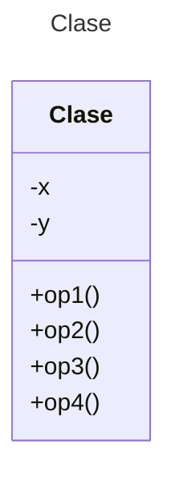

# Proyecto - Java Básico con Desktop 

Plantilla básica para proyecto de Java con interfaces de usuario GUI

## Diagrama de clases
[Editor en línea](https://mermaid.live/)

[Referencia-Mermaid](https://mermaid.js.org/syntax/classDiagram.html)

## Diagrama de clases UML con draw.io
El repositorio está configurado para crear Diagramas de clases UML con ```draw.io```. Para usarlo simplemente agrega un archivo con extensión ```.drawio.png```, das doble clic sobre el mismo y se activará el editor ```draw.io``` incrustado en ```VSCode``` para edición. Asegúrate de agregar las formas UML en el menú de formas del lado izquierdo (opción ```+Más formas```).

Para más información consulta el [MarketPlace](https://marketplace.visualstudio.com/items?itemName=hediet.vscode-drawio).


## Trabajo en Equipo

Revisa [LiveShare](https://youtu.be/9QXwSg9-2qQ). Revisa el [uso de LiveShare](https://www.youtube.com/watch?v=nj535VbE9pQ). Disponible para este repositorio.

## Uso del proyecto con make

### Default - Compilar+Ejecutar
```
make
```
### Compilar
```
make compile
```
### Ejecutar App
```
make run
```
### Limpiar binarios
```
make clean
```
## Comandos individuales
### Compilar

```
find ./ -type f -name "*.java" > compfiles.txt
javac -d build @compfiles.txt
```
Ejecutar ambos comandos en 1 sólo paso:

```
find ./ -type f -name "*.java" > compfiles.txt ; javac -d build @compfiles.txt
```
### Ejecutar App
```
java -cp build miPrincipal.Principal
```
Los comandos anteriores están considerados para un ambiente Linux

## Mostrar el desktop-lite

1. Mostrar la terminal con `Ctrl+ñ`.
2. Dar clic en la pestaña ```PUERTOS``` y localizar el puerto ```desktop(6080)```.
3. En la columna ```Dirección reenviada``` dar clic en el Globo terráqueo para abrir una pestaña del navegador donde estará el *desktop-lite*. 
4. En la nueva pestaña abierta se mostrará el mensaje *noVNC* y dar clic en el botón ```Conectar```.

A partir de este momento, toda la programación Java-GUI se mostrará en el *desktop-lite* (simulará un escritorio de un sistema de Ventanas).

[Referencia](https://github.com/devcontainers/features/tree/main/src/desktop-lite)
